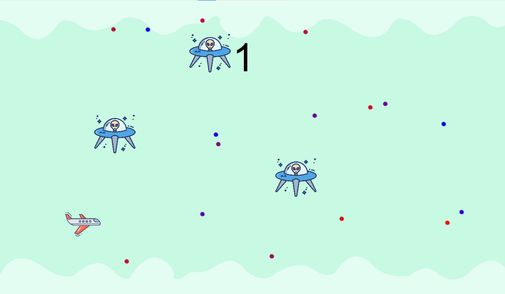

# Dodge the obstacle game
A 2d endless runner game created using C# and Unity Game Engine.

## Developed By
> Nishkarsh Dubb

## Screenshot and Demo Video

Link to the Demo Video: https://www.dropbox.com/s/j2ntg6zorjh5p31/bandicam%202022-12-06%2022-23-52-768.mp4?dl=0

## External Resources used to develop the project: 
1) https://youtu.be/Yb3isH6j-iU 
2) https://www.youtube.com/watch?v=xcmYsc2BY-U 
3) https://www.youtube.com/watch?v=M4O8UOEl5Tg
4) https://www.youtube.com/watch?v=VHFJgQraVUs 
5) https://www.youtube.com/watch?v=ZoZcBgRR9ns 
6) https://www.youtube.com/watch?v=U3sT-T5bKX4
7) https://www.youtube.com/watch?v=RYw8lAI-_Y0

## Understanding the Game:
The name of the game I created is “Dodge the Obstacle”. This is a 2d game created using C# and Unity Game Engine.

## Game Controls:
1) Use Up-Arrow to move vertically up.  
2) Use Down-Arrow to move vertically down.  

## Aim of the game:
In this game, the main game object is an airplane. As the airplane flies through the sky, it encounters some alien spaceships. The aim of the player in this game is to avoid hitting the spaceships.


## Rules of the game:
1) In order for the player to progress through this game, the user must avoid hitting spaceships (obstacles). 
2) As the game progresses and the player stays in the game without hitting the spaceships, the score increases. The score increases by 1 as the deltaTime increases (deltaTime= deltaTime is simply the time in seconds between the last frame and the current frame).
3) As soon as the player hits the obstacle (the spaceship) the game ends (collision detection at play using the 2D collider game object).

## The elements of the game:
0) The game manager
1) The player (airplane)
2) The obstacle (obstacle prefab-> alien spaceship)
3) The background
4) The borders 
5) UI elements such as text, panels, etc.
6) Background music and sound effect
7) The Particle system (particle effect animation)
The three sprites that have been used in this project were: airplane, alien spaceship (obstacle), and background (that loops).

## How did the elements move?
In the game, I have allowed the user to use dynamic (vertical movements) on the Player game object that uses the player sprite (airplane). For our player game object to move, I created a c# script named “Player”. In it, I use a float variable called speedOfPlayer to control the player's speed. I also used the rigidBody2D component for this 2D sprite. This enabled me to put the sprite under the control of the physics engine. I set properties like gravity to 0, so that my airplane appeared such that it was in midair.

## What is rigiBody2D component-> 
Adding a Rigidbody2D component to a sprite puts it under the control of the physics engine. By itself, this means that the sprite will be affected by gravity and can be controlled from scripts using forces. https://docs.unity3d.com/ScriptReference/Rigidbody2D.html 

## Let’s take a brief look at the Player C# script:
using System.Collections;
using System.Collections.Generic;
using UnityEngine;

```
public class Player : MonoBehaviour
{
    public float speedOfPlayer; //will dictate how fast will the player go
    private Rigidbody2D rigidBody; //using simple physics to move the player
    private Vector2 playerDirection; //used to process the player's input

    // Start is called before the first frame update
    void Start()
    {
        rigidBody = GetComponent<Rigidbody2D>(); //fetch rigidbody2d from the player game object
    }

    // Update is called once per frame
    void Update()
    {
        float directionY= Input.GetAxisRaw("Vertical"); // if user presses up key directionY is +1, if down key the directionY is -1
        playerDirection = new Vector2(0, directionY).normalized; //up and down movement//normalized will make movement consistent

    }

    // difference between fixedUpdate and update function is that update is called once per frame ex: timers and detection of inputs
    // Fixed update called once per physics frame example: rigidBody
    void FixedUpdate(){
        rigidBody.velocity=new Vector2(0, playerDirection.y * speedOfPlayer);
    }
}
```

## Now let’s take a brief look at the game manager object…
The game manager object enables us to have the camera movement. In this game we want the camera to be continuously moving forward. Further, I made the player object, and similarly other objects as the child of the game manager object. This is because I want it to look like the player is moving forward. But in reality, the player is still there, the only thing that is moving is our camera. To accomplish this, I create a C# script called backgroundMovement.cs

```
Let’s take a quick look at backgroundMovement.cs->
using System.Collections;
using System.Collections.Generic;
using UnityEngine;

public class backgroundMovement : MonoBehaviour
{
    // We won't be using a start function in this case

    public float backgroundSpeed;

    // Update is called once per frame
    void Update()
    {
        
        transform.position += new Vector3(backgroundSpeed * Time.deltaTime, 0, 0);
    } 
}
```

In this script, we did not need a start function, thus I removed it. The variable camera speed dictates how fast our camera will be moving. In the update function, I continuously change the x-position of the camera. Notice in Vector3 (x, y, z) the value of y and z co-ordinates is 0, because we don’t want to change any of this position, we only want to make changes to the x-position. Then, I attached this script to gameManager object and set the speed.

## Looping Background:
For the looping background I created a 3D game object called quad. 
Link: https://docs.unity3d.com/Manual/Example-CreatingaBillboardPlane.html 
I used the background sprite with the background game object and made it cover the entire screen. The background game object is the child of the gameManager object, since we want our background to move with the camera. For the background to have a loop effect, I created a C# script named loopBg.cs

## Let’s take a quick look at loopBg.cs
```
using System.Collections;
using System.Collections.Generic;
using UnityEngine;

public class loopBg : MonoBehaviour
{
    // we don't need start
    public float backgroundSpeed;
    public Renderer backgroundRenderer;

    // Update is called once per frame
    void Update()
    {
        backgroundRenderer.material.mainTextureOffset += new Vector2(backgroundSpeed * Time.deltaTime, 0f);
    }
}
```

The variable backgroundSpeed dictates how fast our background will be moving. We have also created a Renderer type variable named backgroundRenderer. For the x-cordinate we have a changing value, whereas for y-cordinate we have it set as 0 in Vector2.

## Boundaries (restricting the movement of the airplane to the screen):
I had also created boundaries that would restrict the vertical movement of the player to the screen boundaries. To achieve this, I created some box colliders to prevent our player from moving out of the screen. I created a game object called Borders. Under the borders game object, I had two other game objects named TopBorder and BottomBorder. I made sure the top and bottom box colliders covered the entire screen horizontally (throughout x-axis at top as well as bottom of the screen). The borders game object is the child of the game manager object so that, the border moves along with the camera.


## Spawning Spaceship Obstacles:
For the obstacles I created an obstacle game object and used it with the obstacle sprite. I made obstacle object a prefab. A prefab allows us to create, configure and store a gameObject complete with all its components, property values, etc. as resuable asset. 
Unity 2D Game Design Tutorial 6 - Prefabs - Bing video

```
using System.Collections;
using System.Collections.Generic;
using UnityEngine;

public class spawnobstacles : MonoBehaviour
{

    public GameObject obstacle;

    public float maximumX;
    public float maximumY;
    public float minimumY;
    public float minimumX;
    public float timeBetweenSpawn;
    public float spawnTime;


    // Update is called once per frame
    void Update()
    {
        if(Time.time > spawnTime){
            Spawn();
            spawnTime = Time.time + timeBetweenSpawn;
        }
    }

    void Spawn(){
        float randomX = Random.Range(minimumX, maximumX); // we don't want spawning at the same position
        float randomY = Random.Range(minimumY, maximumY); // we don't want spawning at the same position
        
        Instantiate(obstacle, transform.position + new Vector3(randomX, randomY, 0), transform.rotation);
    }
}
```


## Let’s take a quick look at the spawnObstacles.cs script:
Here maximum and minimum variable values are for obstacles so that they don’t spawn outside our screen.

```
using System.Collections;
using System.Collections.Generic;
using UnityEngine;

public class spawnobstacles : MonoBehaviour
{

    public GameObject obstacle;

    public float maximumX;
    public float maximumY;
    public float minimumY;
    public float minimumX;
    public float timeBetweenSpawn;
    public float spawnTime;


    // Update is called once per frame
    void Update()
    {
        if(Time.time > spawnTime){
            Spawn();
            spawnTime = Time.time + timeBetweenSpawn;
        }
    }

    void Spawn(){
        float randomX = Random.Range(minimumX, maximumX); // we don't want spawning at the same position
        float randomY = Random.Range(minimumY, maximumY); // we don't want spawning at the same position
        
        Instantiate(obstacle, transform.position + new Vector3(randomX, randomY, 0), transform.rotation);
    }
}
```
 
the gameobject obstacle variable consists of the obstacle that we want to spawn. The four float variables maximum, minimum, maximumY, minimumY, allow our obstacles to spawn within the minimum and maximum range for each axis.  The time between spawn dictate the time between spawns and spawnTime is the spawn time. Spawn() method is used to randomly spawn the objects at different positions, whereas in update, we call the spawn method. 

## Destroying objects and game over functionality:
When any of the obstacle game object hits the left end of the screen it is destroyed, else if it touches the plane, the player game object is destroyed. When it hits the plane, the obstacle triggers the OnTriggerEnter2D function. The Obstacle is using 2D circle collider object as well as rigid2D object.

```
using System.Collections;
using System.Collections.Generic;
using UnityEngine;

public class Obstacle : MonoBehaviour
{
    private GameObject player;
    
    void Start()
    {
        player = GameObject.FindGameObjectWithTag("Player");
    }
    private void OnTriggerEnter2D(Collider2D collision)
    {
        if(collision.tag == "Border")
        {
            Destroy(this.gameObject);
        }
        
        else if(collision.tag == "Player")
        {
            Destroy(player.gameObject);
        }
    }
}
```


## Panel that gets displayed on hitting an obstacle:
```
using System.Collections;
using System.Collections.Generic;
using UnityEngine;
using UnityEngine.SceneManagement;

public class gameOver : MonoBehaviour
{

    public GameObject gameOverPanel;


    // Update is called once per frame
    void Update()
    {
        if(GameObject.FindGameObjectWithTag("Player") == null){
            gameOverPanel.SetActive(true);
        }
    }

    public void Restart(){
        SceneManager.LoadScene(SceneManager.GetActiveScene().name);
    }
}
```

## Managing the score
The code bewlo illustrates how the score is being updated. The score is being increased with the passage of deltaTime and as long the player does not hit the obstacle. The text is displayed using the UI element text.

```
using System.Collections;
using System.Collections.Generic;
using UnityEngine;
using UnityEngine.UI;

public class ScoreManager : MonoBehaviour
{
    public Text scoreText;
    private float score;


    // Update is called once per frame
    void Update()
    {
        if(GameObject.FindGameObjectWithTag("Player") != null){
            score+=1*Time.deltaTime;
            scoreText.text=((int)score).ToString();
        }
    }
}
```

For the menu, the UI element, panel has also been used, I also attempted to use buttons.

Additionally, I have also used background music, added sound effects as well as used the particle system effect (animation). https://youtu.be/U3sT-T5bKX4?t=1425 

All in all, it was a fun project, and I learnt a lot!

## Developed using
* C#
* Unity Game Engine

## Setup:
#### Clone this repository:

```bash
git clone https://github.com/Nishkarsh01/2d-endless-runner-game-unity
```
or download the zip file from github.

After extracting the files, you can play the game!
